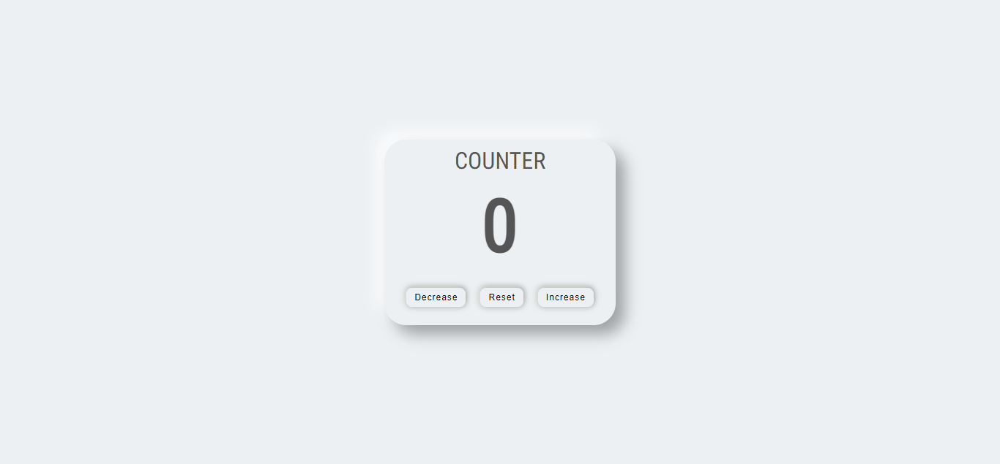

# Simple Javascript Counter

A simple javascript project with great functionality.

## Project Details

**View My Project**: https://abdulhammed24.github.io/Counter/

## Features

* Just like the normal counter, with the increase, reset and decrease button.
* Responsive on mobile phone, tablets , desktop and laptop screens.

## Technologies Used

* **HTML**
* **CSS**
* **JAVASCRIPT**

## Acknowledgements

Project Idea : https://www.youtube.com/watch?v=2jezLluxIIo&t=466s&ab_channel=DThompsonDev